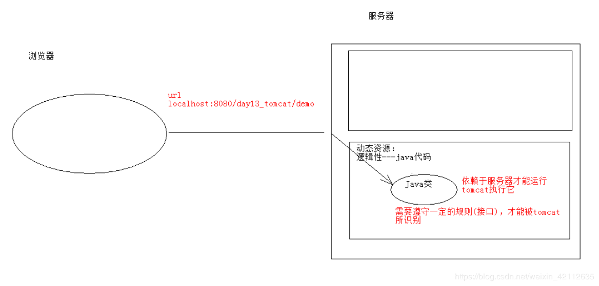
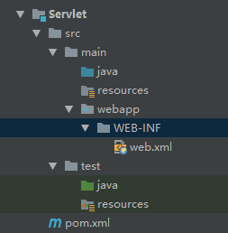

# 1、Servlet 简介

## Servlet 是什么？
Java Servlet 是 `运行在 Web 服务器或应用服务器上的程序` ，它是作为来自 Web 浏览器或其他 HTTP 客户端的请求和 HTTP 服务器上的数据库或应用程序之间的中间层。

使用 Servlet，您可以收集来自网页表单的用户输入，呈现来自数据库或者其他源的记录，还可以动态创建网页。

- Servlet 是sun公司提供一套规范（ `接口` ），用来处理客户端请求、响应给浏览器的动态资源。
- 将来我们自定义一个类，实现 Servlet接口，复写方法。
- Servlet规范（包含三个技术点）：servlet技术、filter技术---过滤器、listener技术---监听器。



## Servlet 作用：用来处理客户端请求、响应给浏览器的动态资源
- 获取请求数据
- 处理请求
- 完成请求

## Servlet 任务
Servlet 执行以下主要任务：
- 读取客户端（浏览器）发送的**显式的数据**。这包括网页上的 HTML 表单，或者也可以是来自 applet 或自定义的 HTTP 客户端程序的表单。
- 读取客户端（浏览器）发送的**隐式的 HTTP 请求数据**。这包括 *cookies*、*媒体类型*和*浏览器能理解的压缩格式等等*。
- 处理数据并生成结果。这个过程可能需要访问数据库，执行 RMI 或 CORBA 调用，调用 Web 服务，或者直接计算得出对应的响应。
- 发送显式的数据（即文档）到客户端（浏览器）。该文档的格式可以是多种多样的，包括文本文件（HTML 或 XML）、二进制文件（GIF 图像）、Excel 等。
- 发送隐式的 HTTP 响应到客户端（浏览器）。这包括告诉浏览器或其他客户端被返回的文档类型（例如 HTML），设置 cookies 和缓存参数，以及其他类似的任务。

## Servlet 包
Java Servlet 是运行在带有支持 Java Servlet 规范的解释器的 web 服务器上的 Java 类。

Servlet 可以使用 javax.servlet 和 javax.servlet.http 包创建，它是 Java 企业版的标准组成部分，Java 企业版是支持大型开发项目的 Java 类库的扩展版本。

这些类实现 Java Servlet 和 JSP 规范。在写本教程的时候，二者相应的版本分别是 Java Servlet 2.5 和 JSP 2.1。

Java Servlet 就像任何其他的 Java 类一样已经被创建和编译。在您安装 Servlet 包并把它们添加到您的计算机上的 Classpath 类路径中之后，您就可以通过 JDK 的 Java 编译器或任何其他编译器来编译 Servlet。

# 2、入门程序
## 1. 创建 Maven 项目

**补全目录结构为下面的 Maven 项目的目录结构：**



**`web.xml`：**

```xml
<!DOCTYPE web-app PUBLIC
 "-//Sun Microsystems, Inc.//DTD Web Application 2.3//EN"
 "http://java.sun.com/dtd/web-app_2_3.dtd" >

<web-app>

</web-app>
```

## 2. 定义一个类，实现 Servlet 接口
```java
public class ServletDemo1 implements Servlet {

}
```

>**注意：**
>但在实际开发中，我们不会直接去实现Servlet接口，因为那样需要覆盖的方法太多，我们一般创建类继承 HttpServlet。
>实现步骤：
>- 创建类继承HttpServlet类
>- 覆盖doGet和doPost
>- 在web.xml中进行servlet的配置

## 3. 实现接口中的抽象方法
```java
package cn.ys.web.servlet;

import javax.servlet.*;
import java.io.IOException;

/**
 * Servlet快速入门
 */
public class ServletDemo1 implements Servlet {

    @Override
    public void init(ServletConfig servletConfig) throws ServletException {

    }

    @Override
    public ServletConfig getServletConfig() {
        return null;
    }

    //提供服务的方法
    @Override
    public void service(ServletRequest servletRequest, ServletResponse servletResponse) throws ServletException, IOException {
        System.out.println("Hello Servlet...");
    }

    @Override
    public String getServletInfo() {
        return null;
    }

    @Override
    public void destroy() {

    }
}
```

## 4. 配置Servlet
- 在web.xml中配置：

```xml
<!DOCTYPE web-app PUBLIC
 "-//Sun Microsystems, Inc.//DTD Web Application 2.3//EN"
 "http://java.sun.com/dtd/web-app_2_3.dtd" >

<web-app>
  <!-- 配置Servlet -->
  <servlet>  <!-- 注册Servlet -->
    <servlet-name>demo1</servlet-name>  <!-- Servlet名称，当前 xml 中唯一 -->
    <servlet-class>cn.ys.servlet.ServletDemo1</servlet-class>   <!-- Servlet 实现类的全限定类名 -->
  </servlet>

  <servlet-mapping>  <!-- 给注册的 Servlet 添加映射路径 -->
    <servlet-name>demo1</servlet-name>  <!-- 已经注册的 Servlet 名称。注意：必须与注册的名称一致 -->
    <url-pattern>/demo1</url-pattern>   <!-- 访问路径。要求：必须以 / 开头 -->
  </servlet-mapping>
</web-app>
```

**测试：**
启动 Tomcat，浏览器输入：http://localhost:8080/demo1
每访问一次，控制台就打印一次 Hello Servlet

## 三、执行原理：

1. 当服务器接受到客户端浏览器的请求后，会解析请求URL路径，获取访问的Servlet的资源路径
2. 查找web.xml文件，是否有对应的<url-pattern>标签体内容。
3. 如果有，则在找到对应的<servlet-class>全类名
4. tomcat会将字节码文件加载进内存，并且创建其对象
5. 调用其方法
