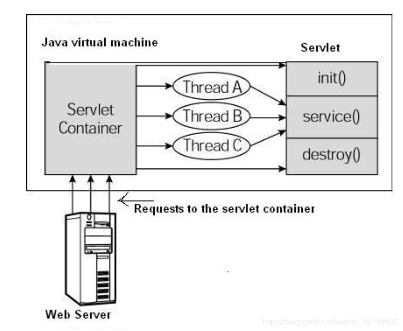

# Servlet 生命周期（API）
Servlet 生命周期可被定义为从创建直到毁灭的整个过程。以下是 Servlet 遵循的过程：
- Servlet 通过调用 `init()` 方法进行初始化。
- Servlet 调用 `service()` 方法来处理客户端的请求。
- Servlet 通过调用 `destroy()` 方法终止（结束）。
- 最后，Servlet 是由 `JVM` 的垃圾回收器进行垃圾回收的。

## `init()` 方法
init 方法被设计成**只调用一次**，说明一个 Servlet 在内存中只存在一个对象，**Servlet 是单例的**。
>注意：
>多个用户同时访问时，可能存在线程安全问题。
>解决：尽量不要在Servlet中定义成员变量。即使定义了成员变量，也不要对修改值

默认情况下，第一次被访问时，Servlet被创建。

`init 方法调用时间`：在**第一次创建 Servlet 时被调用**，在后续每次用户请求时不再调用。因此，它是用于一次性初始化。

`Servlet 创建时间`：用户第一次调用对应于该 Servlet 的 URL 时，但是您也可以指定 Servlet 在服务器第一次启动时被加载。

当用户调用一个 Servlet 时，就会创建一个 Servlet 实例，每一个用户请求都会产生一个新的线程，适当的时候移交给 doGet 或 doPost 方法。init() 方法简单地创建或加载一些数据，这些数据将被用于 Servlet 的整个生命周期。

>注意：
>可以配置执行 Servlet 的创建时机 —— 在`<servlet>`标签下配置
>- 第一次被访问时，创建：`<load-on-startup>`的值为负数
>- 在服务器启动时，创建：`<load-on-startup>`的值为0或正整数

## `service()` 方法（提供服务，可执行多次）
service() 方法是执行实际任务的主要方法。Servlet 容器（即 Web 服务器）调用 service() 方法来处理来自客户端（浏览器）的请求，并把格式化的响应写回给客户端。

每次访问 Servlet 时，Service方法都会被调用一次。

每次服务器接收到一个 Servlet 请求时，服务器会产生一个新的线程并调用服务。service() 方法检查 HTTP 请求类型（GET、POST、PUT、DELETE 等），并在适当的时候调用 doGet、doPost、doPut，doDelete 等方法。

下面是该方法的特征：

service() 方法由**容器调用**，service 方法在适当的时候调用 `doGet、doPost、doPut、doDelete` 等方法。所以，您不用对 service() 方法做任何动作，您只需要根据来自客户端的请求类型来重载 doGet() 或 doPost() 即可。

doGet() 和 doPost() 方法是每次服务请求中最常用的方法。下面是这两种方法的特征。

### `doGet()` 方法
GET 请求来自于一个 URL 的正常请求，或者来自于一个未指定 METHOD 的 HTML 表单，它由 doGet() 方法处理。

### `doPost()` 方法
POST 请求来自于一个特别指定了 METHOD 为 POST 的 HTML 表单，它由 doPost() 方法处理。

## `destroy()` 方法
destroy() 方法**只会被调用一次**，在 Servlet 生命周期结束时被调用。destroy() 方法可以让您的 Servlet 关闭数据库连接、停止后台线程、把 Cookie 列表或点击计数器写入到磁盘，并执行其他类似的清理活动。

只有 **服务器正常关闭**时，才会执行destroy方法，destroy方法在Servlet被销毁之前执行，一般用于释放资源。

在调用 destroy() 方法之后，servlet 对象被标记为垃圾回收。

## 架构图
下图显示了一个典型的 Servlet 生命周期方案。
- 第一个到达服务器的 HTTP 请求被委派到 Servlet 容器。
- Servlet 容器在调用 service() 方法之前加载 Servlet。
- 然后 Servlet 容器处理由多个线程产生的多个请求，每个线程执行一个单一的 Servlet 实例的 service() 方法。

