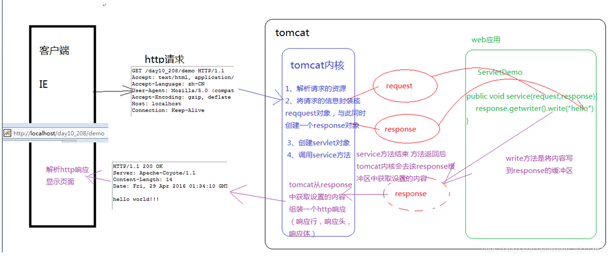
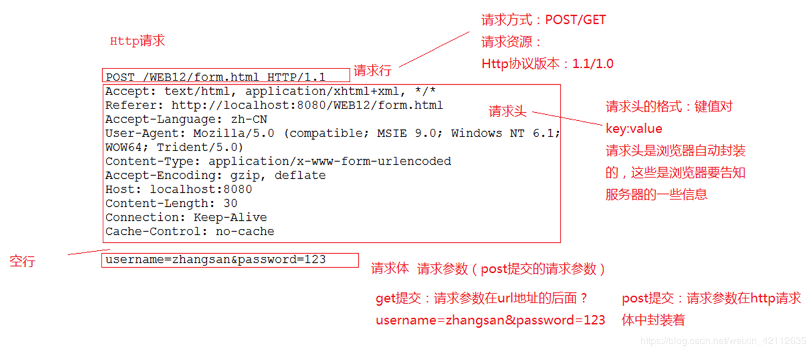

# Request：

## 1 request对象和response对象的原理
1. request和response对象是由服务器创建的。我们来使用它们
2. request对象是来获取请求消息，response对象是来设置响应消息
	
## 2 request对象继承体系结构：	
		ServletRequest		--	接口
			|	继承
		HttpServletRequest	--  接口
			|	实现
		org.apache.catalina.connector.RequestFacade 类(tomcat)

## 3 request功能：
### 3.1 获取请求消息数据
#### 3.1.1 获取请求行数据
	* GET /yang/demo1?name=zhangsan HTTP/1.1
	* 方法：
		1. 获取请求方式 ：GET
			* String getMethod()  
		2. (*)获取虚拟目录：/yang
			* String getContextPath()
		3. 获取Servlet路径: /demo1
			* String getServletPath()
		4. 获取get方式请求参数：name=zhangsan
			* String getQueryString()
		5. (*)获取请求URI：/yang/demo1
			* String getRequestURI():		/yang/demo1
			* StringBuffer getRequestURL()  :http://localhost/yang/demo
			* URL:统一资源定位符 ： http://localhost/yang/demo1	中华人民共和国
			* URI：统一资源标识符 : /day14/demo1					共和国
		
		6. 获取协议及版本：HTTP/1.1
			* String getProtocol(
		7. 获取客户机的IP地址：
			* String getRemoteAddr()
		
### 3.1.2 获取请求头数据
	* 方法：
		* (*)String getHeader(String name):通过请求头的名称获取请求头的值
		* Enumeration<String> getHeaderNames():获取所有的请求头名称

### 以下是来自于浏览器端的重要头信息

- `Accept`：指定浏览器或其他客户端可以处理的 MIME 类型。值 image/png 或 image/jpeg 是最常见的两种可能值。| 
- `Accept-Charset`：指定浏览器可以用来显示信息的字符集。例如 ISO-8859-1。| 
- `Accept-Encoding`：指定浏览器知道如何处理的编码类型。值 gzip 或 compress 是最常见的两种可能值。| 
- `Accept-Language`：指定客户端的首选语言，在这种情况下，Servlet 会产生多种语言的结果。例如，en、en-us、ru 等。| 
- `Authorization`：用于客户端在访问受密码保护的网页时识别自己的身份。| 
- `Connection`：指示客户端是否可以处理持久 HTTP 连接。持久连接允许客户端或其他浏览器通过单个请求来检索多个文件。值 Keep-Alive 意味着使用了持续连接。| 
- `Content-Length`：只适用于 POST 请求，并给出 POST 数据的大小（以字节为单位）。| 
- `Cookie`：把之前发送到浏览器的 cookies 返回到服务器。| 
- `Host`：指定原始的 URL 中的主机和端口。| 
- `If-Modified-Since`：表示只有当页面在指定的日期后已更改时，客户端想要的页面。如果没有新的结果可以使用，服务器会发送一个 304 代码，表示 Not Modified 头信息。| 
- `If-Unmodified-Since`：是 If-Modified-Since 的对立面，它指定只有当文档早于指定日期时，操作才会成功。| 
- `Referer`：指示所指向的 Web 页的 URL。例如，如果您在网页 1，点击一个链接到网页 2，当浏览器请求网页 2 时，网页 1 的 URL 就会包含在 Referer 头信息中。| 
- `User-Agent`：识别发出请求的浏览器或其他客户端，并可以向不同类型的浏览器返回不同的内容。| 

### 3.1.3 获取请求体数据:
请求体：只有POST请求方式，才有请求体，在请求体中封装了POST请求的请求参数
步骤：

	1. 获取流对象
		*  BufferedReader getReader()：获取字符输入流，只能操作字符数据
		*  ServletInputStream getInputStream()：获取字节输入流，可以操作所有类型数据
			* 在文件上传知识点后讲
	2. 再从流对象中拿数据

## 4 其他功能：
### 4.1 获取请求参数通用方式：不论get还是post请求方式都可以使用下列方法来获取请求参数
	1. String getParameter(String name):根据参数名称获取参数值    username=zs&password=123
	2. String[] getParameterValues(String name):根据参数名称获取参数值的数组  hobby=xx&hobby=game
	3. Enumeration<String> getParameterNames():获取所有请求的参数名称
	4. Map<String,String[]> getParameterMap():获取所有参数的map集合

### 中文乱码问题：
	* get方式：tomcat 8 已经将 get 方式乱码问题解决了
	* post方式：会乱码
		* 解决：在获取参数前，设置request的编码request.setCharacterEncoding("utf-8");

		
### 4.2 请求转发：一种在服务器内部的资源跳转方式
	1. 步骤：
		1. 通过request对象获取请求转发器对象：RequestDispatcher getRequestDispatcher(String path)
		2. 使用RequestDispatcher对象来进行转发：forward(ServletRequest request, ServletResponse response) 

	2. 特点：
		1. 浏览器地址栏路径不发生变化
		2. 只能转发到当前服务器内部资源中。
		3. 转发是一次请求

### 4.3 共享数据：
	* 域对象：一个有作用范围的对象，可以在范围内共享数据
	* request域：代表一次请求的范围，一般用于请求转发的多个资源中共享数据
	* 方法：
		1. void setAttribute(String name,Object obj):存储数据
		2. Object getAttitude(String name):通过键获取值
		3. void removeAttribute(String name):通过键移除键值对

### 4.4 获取ServletContext：
	* ServletContext getServletContext()