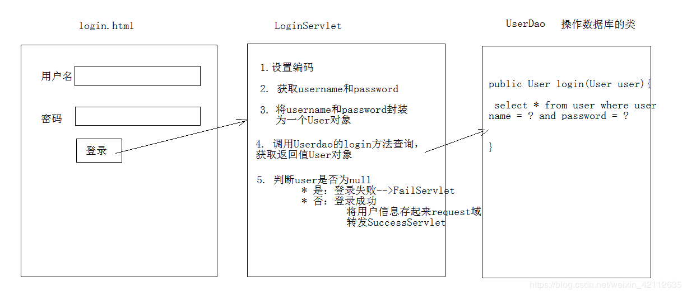

## 需求：
 1. 编写 login.html 登录页面：username & password 两个输入框
 2. 使用 Druid 数据库连接池技术，操作 mysql，day14数据库中user表
 3. 使用JdbcTemplate技术封装JDBC
 4. 登录成功跳转到SuccessServlet展示：登录成功！用户名,欢迎您
 5. 登录失败跳转到FailServlet展示：登录失败，用户名或密码错误

## 分析：


## 开发步骤
1. 创建项目，导入html页面，配置文件，jar包

2. 创建数据库环境
```sql
CREATE DATABASE servlet;
USE servlet;
CREATE TABLE USER(
	id INT PRIMARY KEY AUTO_INCREMENT,
	username VARCHAR(32) UNIQUE NOT NULL,
	PASSWORD VARCHAR(32) NOT NULL
);

INSERT INTO USER VALUES(null,"zhangsan","123456");
INSERT INTO USER VALUES(null,"lisi","1234");
```

3. 创建实体类User

4. 创建工具类JDBCUtils
JDBC工具类 使用Durid连接池

5. 创建UserDao,提供login方法
	
6. 编写LoginServlet类

7. 编写FailServlet和SuccessServlet类

8. login.html中form表单的action路径的写法
* 虚拟目录+Servlet的资源路径

9. BeanUtils工具类，简化数据封装
用于封装JavaBean的

        1. JavaBean：标准的Java类
        	1. 要求：
        		1. 类必须被public修饰
        		2. 必须提供空参的构造器
        		3. 成员变量必须使用private修饰
        		4. 提供公共setter和getter方法
        	2. 功能：封装数据
    
        2. 概念：
        	成员变量：
        	属性：setter和getter方法截取后的产物
        		例如：getUsername() --> Username--> username
    
        3. 方法：
        	1. setProperty()
        	2. getProperty()
        	3. populate(Object obj , Map map):将map集合的键值对信息，封装到对应的JavaBean对象中