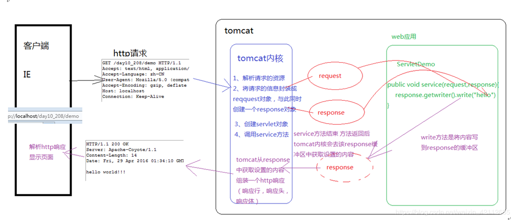
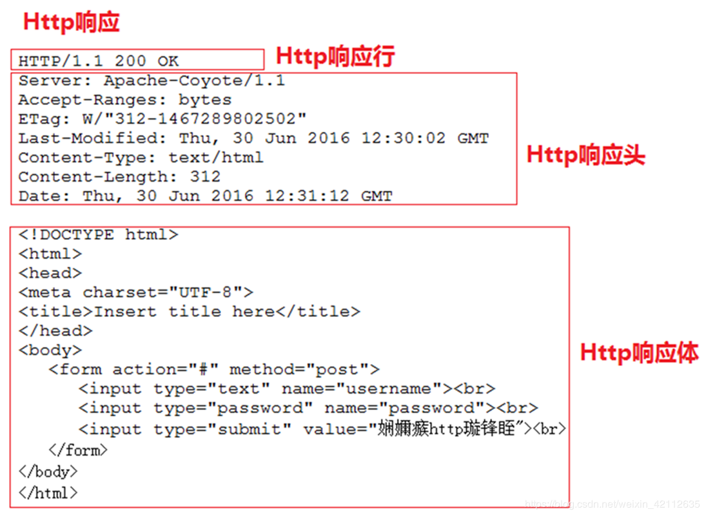
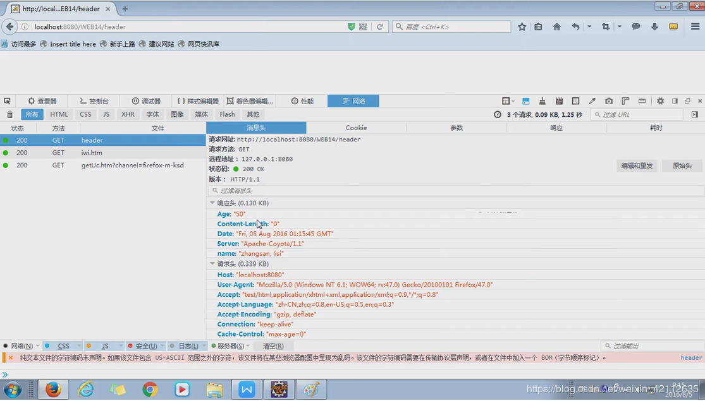

## 1、response的运行流程


## 2、通过抓包工具抓取Http响应


因为response代表响应，所以我们可以通过该对象分别设置Http响应的响应行，响应头和响应体。

## 3、通过 response 设置响应行
**格式**：`HTTP/1.1 200 ok`
**设置响应行的状态码**：`setStatus(int sc)`

## 4、通过response设置响应头
- `addHeader(String name, String value)` 
- `addIntHeader(String name, int value)` 
- `addDateHeader(String name, long date)` 
- `setHeader(String name, String value)` ：设置响应头
- `setDateHeader(String name, long date)` 
- `setIntHeader(String name, int value)`

其中，add表示添加，而set表示设置。
设置定时刷新的头：`response.setHeader("refresh", "5;url=http://www.baidu.com");`

**例子：**
```java
public class HeaderServlet extends HttpServlet {

	protected void doGet(HttpServletRequest request, HttpServletResponse response)
			throws ServletException, IOException {
		
		Date date = new Date();
		
		//设置响应头
		response.addHeader("name", "zhangsan");
		//response.addIntHeader("age", 28);
		//response.addDateHeader("birthday", date.getTime());
		
		response.addHeader("name", "lisi");
		
		response.setHeader("age", "28");
		response.setHeader("age", "50");
		
	}

	protected void doPost(HttpServletRequest request, HttpServletResponse response)
			throws ServletException, IOException {
		doGet(request, response);
	}
}
```



## 5、通过 response 设置响应体
### 响应体设置文本 的 使用步骤：
**1、获取输出流**
- 字符输出流：`PrintWriter getWriter()`
- 字节输出流：`ServletOutputStream getOutputStream()`

**2、使用输出流，将数据输出到客户端浏览器**

- `PrintWriter getWriter()`：获得字符流，通过字符流的write(String s)方法可以将字符串设置到response缓冲区中，随后Tomcat会将response缓冲区中的内容组装成Http响应返回给浏览器端。

- 关于设置中文的乱码问题：
原因：response缓冲区的默认编码是iso8859-1，此码表中没有中文，可以通过	response的setCharacterEncoding(String charset) 设置response的编码。

- 但我们发现客户端还是不能正常显示文字：
原因：我们将response缓冲区的编码设置成UTF-8，但浏览器的默认编码是本地系统的编码，因为我们都是中文系统，所以客户端浏览器的默认编码是GBK，我们可以手动修改浏览器的编码是UTF-8。

- 我们还可以在代码中指定浏览器解析页面的编码方式：
通过response的setContentType(String type)方法指定页面解析时的编码是UTF-8
`response.setContentType("text/html;charset=UTF-8");`

上面的代码不仅可以指定浏览器解析页面时的编码，同时也内含setCharacterEncoding的功能，所以在实际开发中只要编写	response.setContentType("text/html;charset=UTF-8");就可以解决页面输出中文乱码问题。

### 响应头设置字节
- `ServletOutputStream  getOutputStream()`：获得字节流，通过该字节流的write(byte[] bytes)可以向response缓冲区中写入字	节，在由Tomcat服务器将字节内容组成Http响应返回给浏览器。

## 6、重定向与转发
* 重定向：资源跳转的方式
* 代码实现：
	//1. 设置状态码为302
    response.setStatus(302);
    //2.设置响应头location
    response.setHeader("location","/day15/responseDemo2");

* 重定向的特点:redirect
	1. 地址栏发生变化
	2. 重定向可以访问其他站点(服务器)的资源
	3. 重定向是两次请求。不能使用request对象来共享数据
* 转发的特点：forward
	1. 转发地址栏路径不变
	2. 转发只能访问当前服务器下的资源
	3. 转发是一次请求，可以使用request对象来共享数据

## 7、相对路径与绝对路径
1. 路径分类
	1. 相对路径：通过相对路径不可以确定唯一资源
		* 如：./index.html
		* 不以/开头，以.开头路径

		* 规则：找到当前资源和目标资源之间的相对位置关系
			* ./：当前目录
			* ../:后退一级目录
	
	2. 绝对路径：通过绝对路径可以确定唯一资源
		* 如：http://localhost/day15/responseDemo2		/day15/responseDemo2
		* 以/开头的路径

		* 规则：判断定义的路径是给谁用的？判断请求将来从哪儿发出
			* 给客户端浏览器使用：需要加虚拟目录(项目的访问路径)
				* 建议虚拟目录动态获取：request.getContextPath()
				* <a> , <form> 重定向...
			* 给服务器使用：不需要加虚拟目录
				* 转发路径
