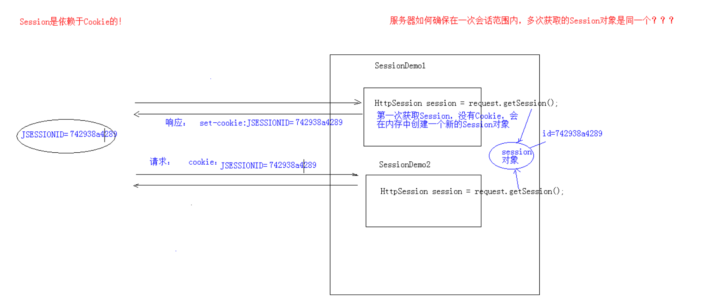

## Session
1. 概念：服务器端会话技术，在一次会话的多次请求间共享数据，将数据保存在服务器端的对象中。HttpSession

2. 快速入门：

	    1. 获取HttpSession对象：
	    	HttpSession session = request.getSession();
	    
	    2. 使用HttpSession对象：
	    	Object getAttribute(String name)  
	    	void setAttribute(String name, Object value)
	    	void removeAttribute(String name)  

3. 原理
	* Session的实现是依赖于Cookie的。

4. 细节：

	    1. 当客户端关闭后，服务器不关闭，两次获取session是否为同一个？
	    	* 默认情况下。不是。
	    	* 如果需要相同，则可以创建Cookie,键为JSESSIONID，设置最大存活时间，让cookie持久化保存。
	    		 Cookie c = new Cookie("JSESSIONID",session.getId());
	             c.setMaxAge(60*60);
	             response.addCookie(c);
    
	    2. 客户端不关闭，服务器关闭后，两次获取的session是同一个吗？
	    	* 不是同一个，但是要确保数据不丢失。tomcat自动完成以下工作
	    		* session的钝化：
	    			* 在服务器正常关闭之前，将session对象系列化到硬盘上
	    		* session的活化：
	    			* 在服务器启动后，将session文件转化为内存中的session对象即可。
	    		
	    3. session什么时候被销毁？
	    	1. 服务器关闭
	    	2. session对象调用invalidate() 。
	    	3. session默认失效时间 30分钟
	    		选择性配置修改	
	    		<session-config>
	    	        <session-timeout>30</session-timeout>
	    	    </session-config>

 5. session的特点
 
	     1. session用于存储一次会话的多次请求的数据，存在服务器端
	     2. session可以存储任意类型，任意大小的数据
    
## session与Cookie的区别：
		1. session存储数据在服务器端，Cookie在客户端
		2. session没有数据大小限制，Cookie有
		3. session数据安全，Cookie相对于不安全

## 案例：验证码
	1. 案例需求：
		1. 访问带有验证码的登录页面login.jsp
		2. 用户输入用户名，密码以及验证码。
			* 如果用户名和密码输入有误，跳转登录页面，提示:用户名或密码错误
			* 如果验证码输入有误，跳转登录页面，提示：验证码错误
			* 如果全部输入正确，则跳转到主页success.jsp，显示：用户名,欢迎您
